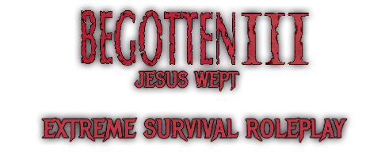

<h1 align="center" style="color:red;">
WARNING THIS CODEBASE IS DEPRECATED
</h1>

<i>This prototype represents an unreleased version of Prelude in its entirety. At this time, the original team has no plans to continue maintaining this codebase. Feel free to use or adapt any parts of it that you find useful. Some highlights include the deployables system, the mounted weapons system, the mounted combat system (vehicles), and various other changes across the schema. It also includes a barebones but functional translation system for chat messages. This copy of the gamemode is not up to date with the main version of Begotten. Expect errors and other issues, as this code was not ready for full release.</i>

<b>Supported Maps: [rp_begotten3](https://steamcommunity.com/sharedfiles/filedetails/?id=2442244710), [rp_district21](https://steamcommunity.com/sharedfiles/filedetails/?id=3126101449), rp_Prelude</b>

<b>Recommended Players: 60-80</b>

<b>Recommended Tickrate: 22-33</b>

Begotten III is licenced under [Creative Commons Attribution-NonCommercial 4.0 International](https://creativecommons.org/licenses/by-nc/4.0/deed.en), so you may not use it for commercial purposes.

## Content

<b>[Begotten III Addon Collection](https://steamcommunity.com/workshop/filedetails/?id=2443075973)</b>

<b>[District 21 Addon Collection](https://steamcommunity.com/sharedfiles/filedetails/?id=3380244456)</b>

<b>[Prelude Content](https://steamcommunity.com/sharedfiles/filedetails/?id=3009410650)</b>

## Credits

[Clockwork](https://github.com/CloudSixteen/Clockwork) was developed by Cloud Sixteen, but the Begotten III framework also uses code from Alex Grist, Mr. Meow, and zigbomb.

### Original Team Members
DETrooper - Lead Programmer/Mapper/Animator

gabs - Lead Designer/Model Porting & Rigging

cash wednesday - Programmer

alyousha35 - Programmer

sky - Mapping (Scraptown)

Minor code contributions by venty.

### Post-Release Contributors

filterfeeder - Models & Animations

dave - Programming

Vlad - Programming

sprite - Programming

bokser - Programming

daedalus_10 - Programming

robert - Models

bmoc - Models

kyah - Models

gus - Mapping (District 21/rp_Prelude)

grenlin - Mapping

ObamasGrandpa - Exploit Reporting/Fixing

Other [contributors](https://github.com/DETrooper/Begotten-III/graphs/contributors) who contribute pull requests.

Various other people in the discord who report bugs.

### External Addons
Begotten III utilizes some modified external addons as well, so the lua is included in the addons folder of this release. The originals can be found below for credit purposes.

[WiltOS Animation Extension](https://steamcommunity.com/sharedfiles/filedetails/?id=757604550)

[WiltOS Rollmod](https://steamcommunity.com/sharedfiles/filedetails/?id=870925571)

[Double Jump](https://steamcommunity.com/sharedfiles/filedetails/?id=284538302)

[PAC3](https://steamcommunity.com/sharedfiles/filedetails/?id=104691717)

[DRGBase](https://steamcommunity.com/sharedfiles/filedetails/?id=1560118657)

[DRG Animal Kingdom](https://steamcommunity.com/sharedfiles/filedetails/?id=3047891625)

[Smooth Scrolling](https://steamcommunity.com/sharedfiles/filedetails/?id=2556148920)

[Darken217's SciFi Weapons](https://steamcommunity.com/sharedfiles/filedetails/?id=420970650)

I also highly recommend [this addon](https://steamcommunity.com/sharedfiles/filedetails/?id=1907060869) to improve server performance.

If your server is struggling to maintain performance or you have no need to use it, it is advised to disable PAC3.

Visit us on [Discord](https://discord.gg/zJnWjcW) for any questions, comments, or concerns.

### A Quick Note on Vehicles
To get our vehicles working you need to configure the vehicle spawn beacon entity positions in the plugin, and the same applies to modification stations. Vehicle deeds are items used to assign ownership of vehicles; a player becomes the owner by using a deed on a vehicle. Once owned, vehicles can only be spawned near configured beacons. Vehicle jousting is unfinished, but some remnants of this system may still exist in the code. The "shoot from vehicle" functionality was buggy and never completed. The backend for vehicle ram damage has been rewritten and should now reliably detect and handle blocking, vehicle-vs-vehicle ramming, and deployables. Vehicles were originally intended to function as cavalry units for scrappers, which is why their equipment is relatively weak. The oil terminal entity provides fuel for the players' vehicles via a minigame.
